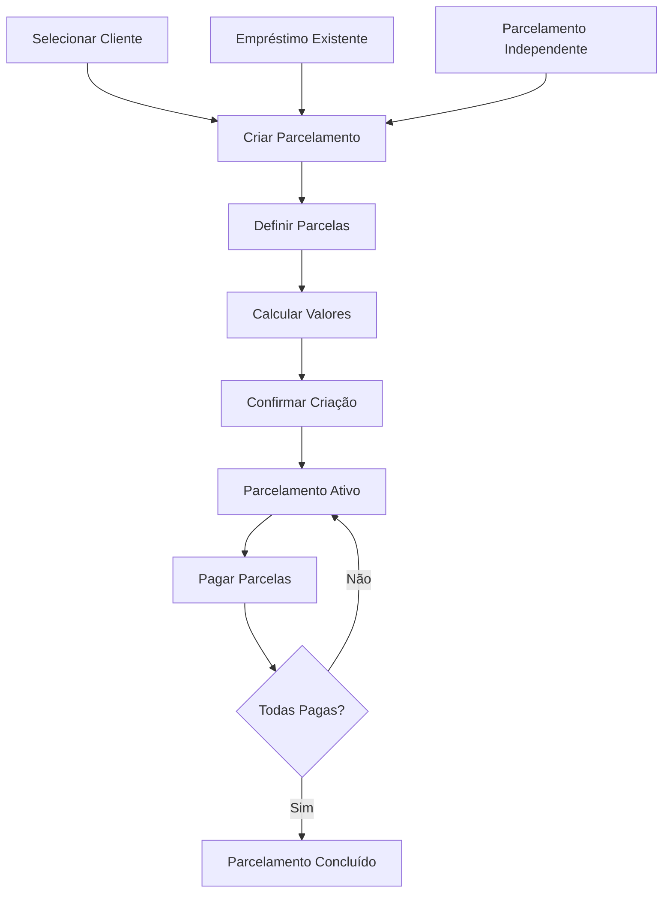

# 📊 Sistema de Parcelamentos - Nexus Gestão Financeira

## ✅ Funcionalidades Implementadas

### 🎯 Recursos Principais

1. **✨ Criação de Parcelamentos**
   - Modal intuitivo para criar novos parcelamentos
   - **NOVO**: Seleção direta de qualquer cliente cadastrado no sistema
   - **NOVO**: Criação de parcelamentos independentes (sem empréstimo vinculado)
   - Seleção opcional de empréstimos existentes do cliente
   - Cálculo automático de parcelas com ou sem juros
   - Visualização de resumo antes da criação
   - Suporte a juros compostos mensais

2. **📋 Gestão de Parcelamentos**
   - Tabela de parcelamentos ativos
   - Visualização de progresso (parcelas pagas/total)
   - Status em tempo real
   - Ações para visualizar detalhes e cancelar

3. **💰 Controle de Pagamentos**
   - Registro individual de pagamento de parcelas
   - Suporte a pagamentos parciais
   - Diferentes métodos de pagamento
   - Atualização automática de status

4. **🔍 Visualização Detalhada**
   - Modal de detalhes com informações completas
   - Tabela de todas as parcelas do parcelamento
   - Status visual com cores diferenciadas
   - Histórico de pagamentos

## 🗄️ Estrutura do Banco de Dados

### Tabelas Criadas

#### `installments` - Parcelamentos
```sql
- id (UUID): Identificador único
- loan_id (UUID): Referência ao empréstimo original (OPCIONAL - pode ser NULL)
- client_id (UUID): Referência ao cliente (OBRIGATÓRIO)
- total_amount (DECIMAL): Valor total a ser parcelado
- total_installments (INTEGER): Número total de parcelas
- installment_amount (DECIMAL): Valor de cada parcela
- first_due_date (DATE): Data do primeiro vencimento
- interest_rate (DECIMAL): Taxa de juros mensal (%)
- status (TEXT): Status do parcelamento (active, completed, cancelled)
- notes (TEXT): Observações
- created_by (UUID): Usuário que criou
- created_at, updated_at (TIMESTAMP): Datas de controle
```

#### `installment_payments` - Parcelas Individuais
```sql
- id (UUID): Identificador único
- installment_id (UUID): Referência ao parcelamento
- installment_number (INTEGER): Número da parcela
- amount (DECIMAL): Valor da parcela
- due_date (DATE): Data de vencimento
- paid_date (DATE): Data do pagamento
- paid_amount (DECIMAL): Valor efetivamente pago
- status (TEXT): Status da parcela (pending, paid, overdue, partial)
- payment_method (TEXT): Método de pagamento
- notes (TEXT): Observações do pagamento
- created_at, updated_at (TIMESTAMP): Datas de controle
```

## 🚀 Como Usar

### 1. **Configurar o Banco de Dados**
```bash
# Execute no SQL Editor do Supabase:
cat setup-installments-table.sql
```

### 2. **Criar um Parcelamento**
1. Acesse a aba "Parcelamento"
2. Clique em "Criar Parcelamento para Cliente"
3. **Selecione o cliente** (obrigatório)
4. **Opcionalmente** selecione um empréstimo existente do cliente ou deixe em branco para criar um parcelamento independente
5. Configure:
   - Valor total a parcelar
   - Número de parcelas (2-60)
   - Taxa de juros (opcional)
   - Data do primeiro vencimento
   - Observações
6. Clique em "Calcular Parcelas" para visualizar o resumo
7. Confirme a criação

### 3. **Gerenciar Pagamentos**
1. Na tabela de parcelamentos ativos, clique em "Ver Detalhes"
2. Na tabela de parcelas, clique em "Pagar" na parcela desejada
3. Informe:
   - Valor pago
   - Data do pagamento
   - Método de pagamento
   - Observações (opcional)
4. Confirme o pagamento

### 4. **Acompanhar Progresso**
- **Status das Parcelas:**
  - 🟡 Pendente: Ainda não foi paga
  - 🔴 Vencida: Passou da data de vencimento
  - 🟠 Parcial: Pago valor menor que o total
  - 🟢 Paga: Quitada completamente

- **Status dos Parcelamentos:**
  - 🔵 Ativo: Em andamento
  - 🟢 Concluído: Todas as parcelas pagas
  - ⚫ Cancelado: Parcelamento cancelado

## 🔧 Recursos Técnicos

### Cálculo de Juros
```javascript
// Sem juros
valorParcela = valorTotal / numeroParcelas

// Com juros compostos
taxaMensal = taxaJuros / 100
fator = (1 + taxaMensal) ^ numeroParcelas
valorParcela = valorTotal * (taxaMensal * fator) / (fator - 1)
```

### Funcionalidades Automáticas
- ✅ **Triggers de Status**: Atualização automática do status do parcelamento
- ✅ **RLS (Row Level Security)**: Segurança em nível de linha
- ✅ **Índices**: Performance otimizada para consultas
- ✅ **Validações**: Constraints e validações de dados

### Integrações
- 🔗 **Empréstimos**: Vinculação opcional com empréstimos existentes
- 🔗 **Clientes**: Associação direta e obrigatória com clientes
- 🔗 **Usuários**: Rastreamento de quem criou cada parcelamento
- ✨ **Parcelamentos Independentes**: Criação de acordos de pagamento sem necessidade de empréstimo vinculado

## 📋 Interface do Usuário

### Modais Implementados
1. **🆕 Novo Parcelamento**: Formulário completo com validações
2. **🔍 Detalhes do Parcelamento**: Visualização completa com tabela de parcelas
3. **💳 Pagamento de Parcela**: Registro rápido de pagamentos

### Tabelas Implementadas
1. **📊 Parcelamentos Ativos**: Lista todos os parcelamentos em andamento
2. **⏰ Empréstimos Vencidos**: Mostra empréstimos disponíveis para parcelamento

## 🛡️ Segurança e Validações

- ✅ Validação de campos obrigatórios
- ✅ Verificação de valores mínimos/máximos
- ✅ Controle de acesso por usuário
- ✅ Prevenção de duplicação de dados
- ✅ Auditoria completa com timestamps

## 🔄 Fluxo de Trabalho



## 📈 Próximos Passos (Sugestões)

1. **📊 Relatórios de Parcelamento**
   - Relatório de inadimplência de parcelas
   - Análise de efetividade dos parcelamentos
   - Previsão de recebimentos

2. **🔔 Notificações**
   - Alertas de parcelas próximas ao vencimento
   - Lembretes automáticos por email/SMS

3. **📱 Funcionalidades Avançadas**
   - Renegociação de parcelas
   - Desconto para pagamento antecipado
   - Parcelamento de parcelamentos

4. **🎨 Melhorias de UX**
   - Dashboard específico para parcelamentos
   - Gráficos de evolução de pagamentos
   - Exportação de dados

---

## 🎉 Conclusão

O sistema de parcelamentos está completamente funcional e integrado ao sistema existente. Todas as funcionalidades principais foram implementadas com foco na usabilidade e segurança dos dados.

Para dúvidas ou sugestões, consulte a documentação do projeto principal.